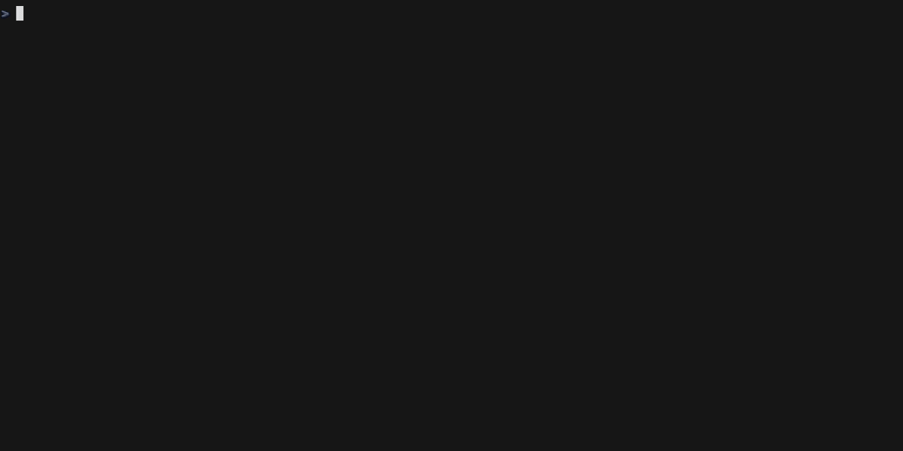
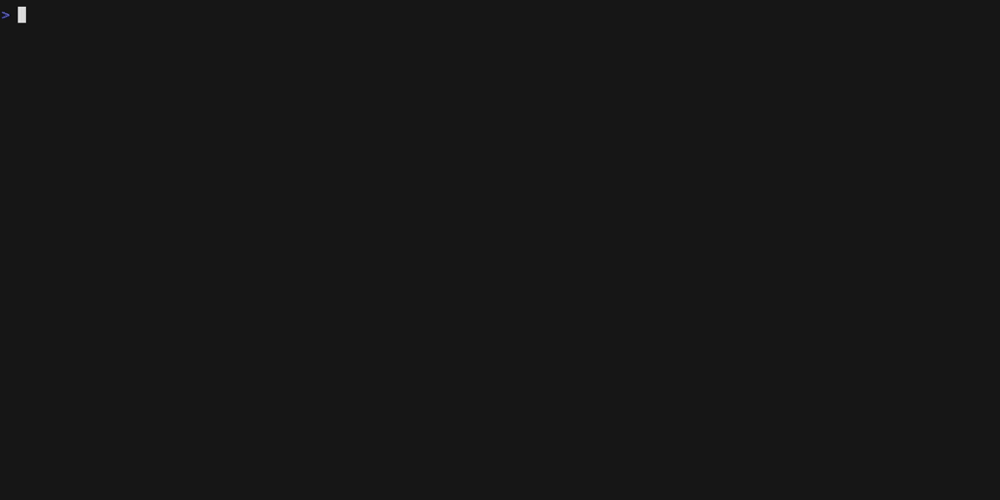

<div align="center">
    
</div>

# <div align="center">Gocovsh - Go Coverage in your terminal</div>


`gocovsh` is a tool for exploring [Go Coverage
reports](https://go.dev/blog/cover) from the command line.

Don't skip the [Giving back](#giving-back) section! 💰

[Demo](#demo) below 🎬 👇

There is a Russian word *Ковш* (pronounced like "Kovsh") which means *a ladle*
or *a dipper*. ["The Big Dipper"](https://en.wikipedia.org/wiki/Big_Dipper) is
also a part of the constellation [Ursa
Major](https://en.wikipedia.org/wiki/Ursa_Major), thus the friendly
dipper-shaped Gopher mascot, created by [Michael Zolotov](https://www.mzolotov.com/).

## <div align="center">  [](https://goreportcard.com/report/github.com/orlangure/gocovsh) [](https://codecov.io/gh/orlangure/gocovsh)
</div>

## Installation

### Using [Homebrew](https://brew.sh/)

```bash
brew install orlangure/tap/gocovsh
```

### Pre-built binary

Grab your pre-built binary from the
[Releases](https://github.com/orlangure/gocovsh/releases) page.

### From source

```bash
# install latest, probably unreleased version
go install github.com/orlangure/gocovsh@latest

# or install a specific version
go install github.com/orlangure/gocovsh@v0.5.1
```

## Usage

1. Generate Go coverage report at your project's root with
    ```bash
    go test -cover -coverprofile coverage.out
    ```

   For more information about generating Go coverage reports, see 📝 [my blog
   post](https://fedorov.dev/posts/2020-06-27-golang-end-to-end-test-coverage/).

2. Run `gocovsh` at the same folder with `coverage.out` report and `go.mod`
   file (`go.mod` is required).

   ```bash
   gocovsh                        # show all files from coverage report
   git diff --name-only | gocovsh # only show changed files
   git diff | gocovsh             # show coverage on top of current diff
   gocovsh --profile profile.out  # for other coverage profile names
   ```

3. Use `j/k/enter/esc` keys to explore the report. See built-in help for more
   key-bindings.

## Themes

`gocovsh` supports 3 nice themes (using [Catppuccin
Theme](https://github.com/catppuccin/catppuccin) project) and an ugly default
one at this moment. To change the theme, set `GOCOVSH_THEME` environment
variable to one of the following values: `mocha`, `latte` or `macchiato`:

```bash
GOCOVSH_THEME=mocha gocovsh
GOCOVSH_THEME=latte gocovsh
GOCOVSH_THEME=macchiato gocovsh
```

To always use the same theme, add `export GOCOVSH_THEME=<theme name>` to your
`~/.bashrc`, `~/.zshrc` or any other file that you use for shell configuration.

## Giving back

This is a free and open source project that hopefully helps its users, at least
a little. Even though I don't need donations to support it, I understand that
there are people that wish to give back anyway. If you are one of them, I
encourage you to [plant some trees with Tree
Nation](https://tree-nation.com/plant/offer) 🌲 🌳 🌴

If you want me to know about your contribution, make sure to use
`orlangure+gocovsh@gmail.com` as the recipient email.

Thank you!

## Demo

### Viewing Go code coverage reports


### Only show Go code coverage of changed files


### Go code coverage on top of `git diff`

